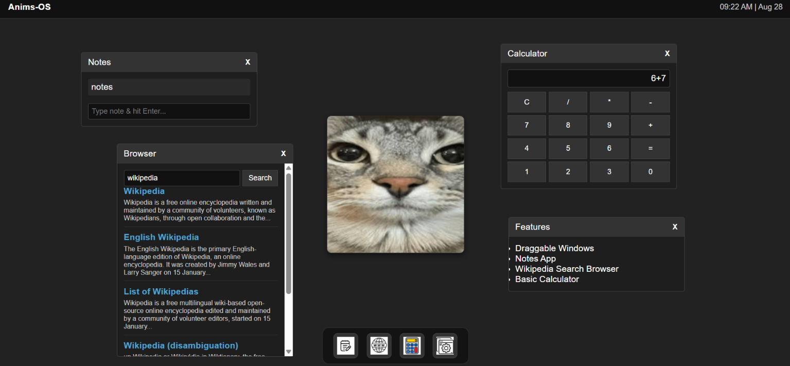

# Anims-OS

* this is small basic os which is totally web based

# Screenshot 

# features 

* it has a basic notes app
* it has wiki pedia browser
* it has a cat image in center
* it has dark theme 
* you can drag any window
* you can see time
* you cana see date
* it has basic calculator

# demo link 

https://15freaker.github.io/Anims-OS/

# how to use it locally 

* install the code from github
* doble click "index.html" file
* it will open in your browser totally locally.

